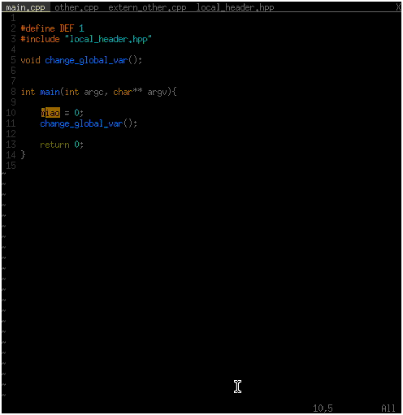

vim-clang-refactor
==============

This is a vim plugin that passes information from vim to clang-refactor [clang refactor](https://github.com/realincubus/clang-refactor). 
It is based on vim-clang-format.


### Installation

#### clang-refactor

First you have to install clang-refactor. 
Read the README of [clang-refactor](https://github.com/realincubus/clang-refactor) for install instructions.

#### vim-clang-refactor with a plugin manager

If you are using vundle, add:

```sh
Bundle 'realincubus/vim-clang-refactor'
```
to your .vimrc and issue :BundleInstall

#### vim-clang refactor by hand

dont know

### Usage

#### Single file

Run the commands 
:ClangRefactorPow
:ClangRefactorHypot
:ClangRefactorUnary
...

These transformations will be applied to the whole file.
If you want to limit them to a part of the file, select a block using `v` and start typing the command.

Something like 
```sh
:'<,'>ClangRefactorPow
```
will be in the command line of vim.


#### Multiple files

There are some commands like Rename that will be automaticaly execute the command on all files that are in the compile_commands.json file. For more information read the clang-refactor README.

### Problems

My knowledge about vimscript is very limited.
I just took clang-format and added some code to get it running. 
I think one can make it much more easy to use but right now dont have the time to do that.
If someone wants to participate feal free to submit pull requests.

One has to open vim in the same folder where the compile_commands.json file resides.


